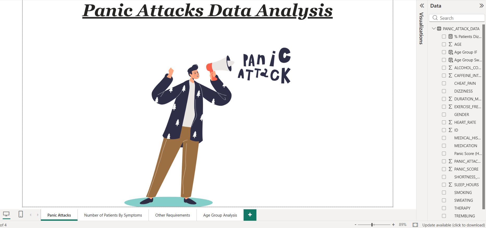
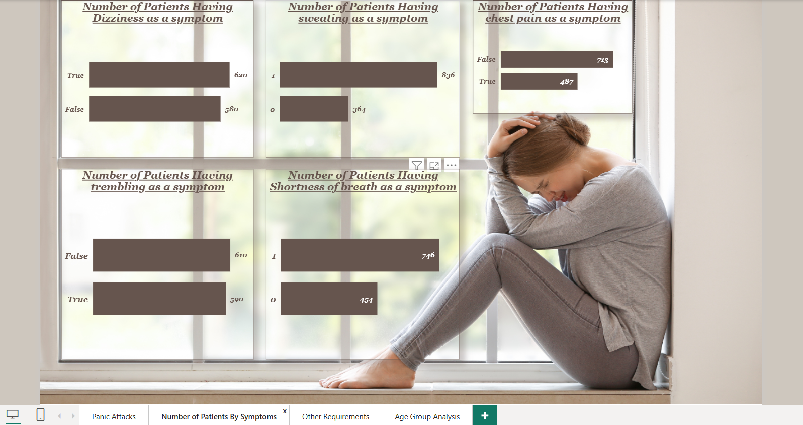
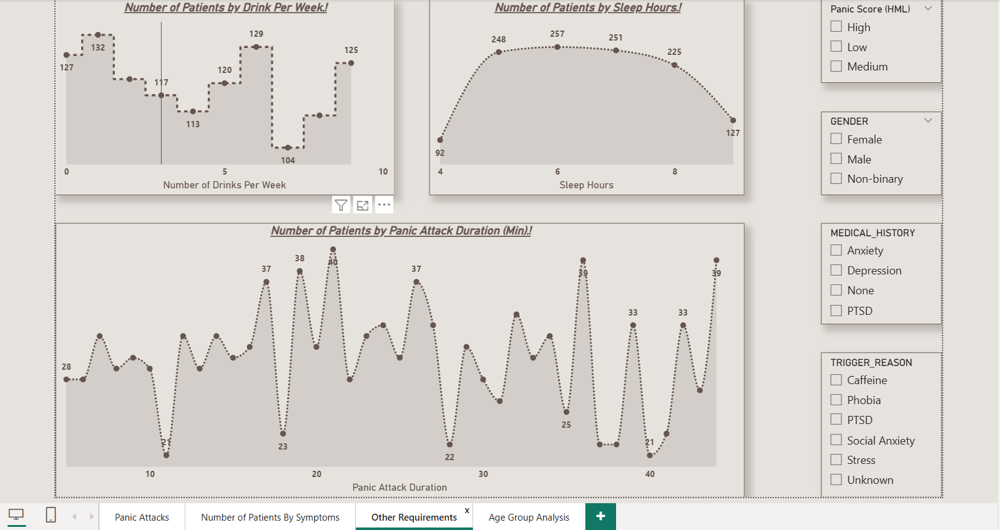
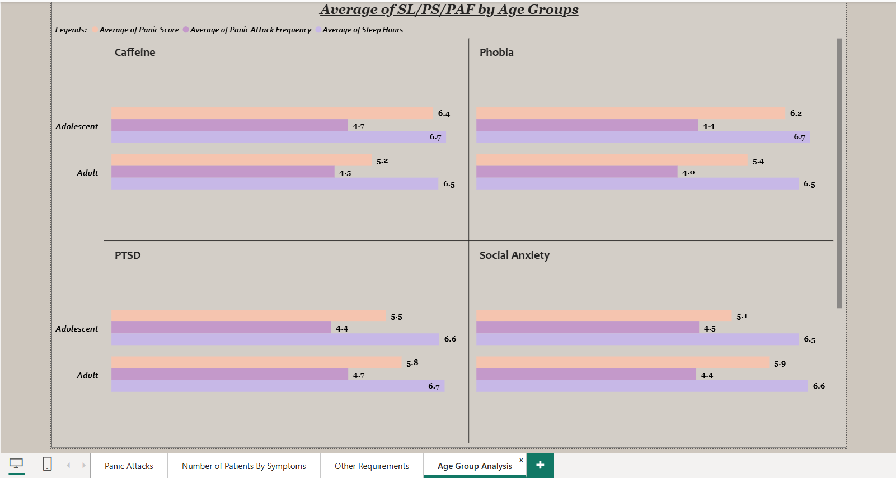

# Panic Attack Analysis Dashboard

## Project Overview
An interactive Business Intelligence dashboard built to analyze panic attack patterns, patient demographics, symptoms, triggers, and health-related factors.

The dashboard helps identify trends and insights using data visualization and analytical techniques.

## Tools & Technologies

- Power BI
- DAX (Data Analysis Expressions)
- Snowflake SQL
- Data Cleaning
- Data Visualization
- Business Intelligence

## Key Features

- Patient demographic analysis
- Panic attack frequency tracking
- Symptom distribution analysis
- Trigger factor analysis
- Health impact insights
- Interactive filters and slicers

## Dashboard Preview

### Page 1

### Page 2

### Page 3

### Page 4

## Data Processing

- Imported dataset into Snowflake
- Performed data cleaning using SQL queries
- Created calculated measures using DAX
- Built interactive Power BI visuals

## DAX Measures Created

Examples:
- Total Patients
- Average Age
- Panic Attack Count
- Severity Analysis
- Percentage Distribution

## Business Insights

- Identified common panic attack triggers
- Analyzed symptom patterns
- Compared severity levels across demographics

## Skills Demonstrated

SQL | Power BI | DAX | Data Modeling | Dashboard Design | Data Analytics
